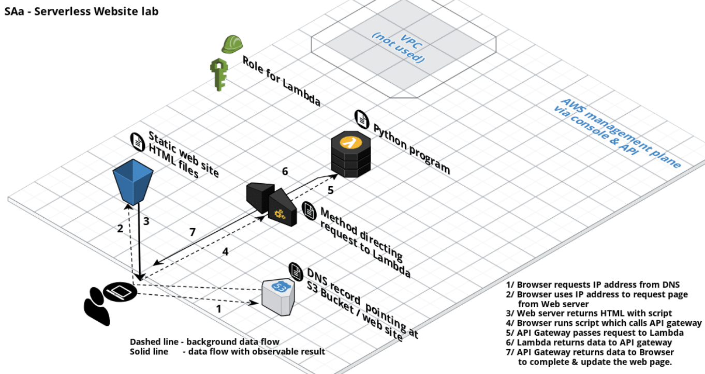

# AWS certified solutions architect associate

> Invention requires two things:  
> 1. The ability to try a lot of experiments  
> 2. not having to live with the collateral damage of failed experiments.
> - Andy Jassy (CEO AWS)

## Exam

- 130 min
- 60 multiple-choice, mostly scenario based, questions
- results between 100-1000, passed is 720
- qualification is valid for 2 years

## Core services

- Security, identity and compliance (IAM, …)
- Network and content delivery (Route53, Cloudfront, VPC, …)
- Compute (EC2, Lambda)
- Storage (S3)
- Databases (RDS, DynamoDB, Redshift)

## Auxilliary services

- Analytics
- Management and governance
- Desktop and app streaming
- Migration and transfer
- Machine learning

# Tips for the exam

## You should know about

- [Optimising S3 Key (File) names for heavy load](http://docs.aws.amazon.com/AmazonS3/latest/dev/request-rate-perf-considerations.html)
- [Optimising DynamoDB operations](http://docs.aws.amazon.com/amazondynamodb/latest/developerguide/QueryAndScanGuidelines.html)
- [ELB and session cookies](http://docs.aws.amazon.com/ElasticLoadBalancing/latest/DeveloperGuide/elb-sticky-sessions.html)
- CORS
- Resources that Elastic Beanstalk can create
- CloudFormation Output section and Function you would use
- SNS message format

## Not covered in the CloudGuru-course

- Options on authenticating using LDAP together with IAM.

# API gateway

- Service making it easy to publish, maintain, monitor and secure API´s
- Connects to Lambda, DynamoDB, EC2
- Can send each endpoint to a different target
- Scale effortlessly (no autoscaling groups or similar)
- Can throttle requests to prevent overflow attacks
- Can be monitored via CloudWatch
- Supports endpoint caching (with a set TTL)
- _Error: Origin policy cannot be read at the remote resource_ ⇒ CORS needs to be enabled on API gateway

## How to configure and deploy

1. Define an API
2. Define resources and nested resources (URL paths)
   1. Select supported http methods
   2. Set security
   3. Set target (EC2, Lambda, DynamoDB, …)

# Elastic transcoder

- Media transcoder, converts media files from source format into other formats
- Provides presets for popular output formats
- Pay per transcoded minute and output resolution

## Example of usage

1. Files are uploaded to a S3 bucket (i.e. with file upload from website)
2. A lambda function is triggered which will read metadata and send it to elastic transcoder
3. The elastic transcoder transcodes the video to multiple formats/resolution for different devices
4. The transcoded files are uploaded to S3

# Kinesis

Definitions

- Streaming data is data generated continuously by a large number of data sources, typically sending data records simultaneously and in small sizes (KB).  
  Ex: stock prices, game data, purchases from online stores, social network data (twitter), geospatial data, iot sensor data…

## Kinesis streams

- Data producers (EC2, iot, mobile phones) streams data to Kinesis streams.
- Data is stored for 24 hours by default, can be stored up to 7 days
- Data is contained in shards
  - Data capacity of stream is a function of the number of shards.
  - Total capacity is the sum of capacity of its shards.
- Consumers (EC2 instances) can analyse the data in shards and store it in RDS, DynamoDB, S3, …
- Limits:
  - Read: 5 transactions per second, up to 2 MB/s data
  - Write: Up to 1 000 records per second, up to 1 MB/s data

## Kinesis Firehose

- Data producers (EC2, iot, mobile phones) streams data to Kinesis Firehose
- Lacks persistent storage
- Possible to have Lambda functions in Firehose that processes data directly
- Data should be outputted to somewhere safe (S3)

## Kinesis analytics

- Works with Streams and Firehose to analyse data on the fly when it comes in

# Message queues

## SQS

- Distributed queue system that enables web applications to get access to a message queue
- Pull based, consumers (EC2 instances, …) needs to pull messages from the queue
- Size limit of 256 KB per message (larger messages are possible, but then S3 is used for storage)
- Messages can be kept in queue from 1 minute to 14 days, default is 4 days
- The time the message is invalid in the queue after a reader picks up the message is called _visibility time out_. Maximum of 12 hours.  
  If the job is picked up, but not processed within the visibility time, the message will be visible on the queue again (dead letter queue, DLQ) and another reader will process it.

Two polling strategies:

- Short polling, messages are returned immediately. If queue is empty, nothing will be returned.
- Long polling, allows for polling empty queues and wait until message arrives (or polling times out)

Two types of queues

- Standard queues (default)
  - High capacity
  - Guarantee of message delivery
  - Drawback: messages might be delivered multiple times and might be out of order
- First in first out (FIFO) queues
  - Order is preserved and no duplications will occur
  - Supports message groups, allowing multiple ordered message groups within a queue
  - Limited to 300 transactions per second

## Simple work flow service (SWF)

- Used to coordinate work (tasks) across distributed application components
- Tasks are steps that can be performed by code, remote web calls or _human action_.  
  Example: a web store which has multiple processing steps (place order, deduct credit card) and _human actions_ (pick order in warehouse)
- Workflow executions can last up to 1 year
- Presents a task oriented API (whereas SQS offers a message-oriented API)
- Ensures that a task is assigned only once and never duplicated
- Keeps track of all the tasks and events in an application (in SQS application-level tracking needs to be implemented by yourself)

- SWF actors
  - _Workflow starters_, an application that can initiate a workflow, e.g. web shop when order is placed.
  - _Deciders_, controls the flow of activity tasks in a workflow execution, decides what to do if task has finished or failed.
  - _Activity workers_, carries out the work.

## Simple notification service (SNS)

- Web service allowing push notifications to mobile devices, sms, e-mail, SQS queues, HTTP endpoints
- Instantaneous push-based delivery (no polling)
- Pub/sub using topics
- Inexpensive, pay-as-your-go model with no upfront
- Easy configured in the web console

## SNS or SQS or SWF

- SNS and SQS are both message services
  - SNS: push
  - SQS: pull/poll
- SWF is task oriented

# AWS general terminology

- A region is a geographical area consisting of two (or more) availability zones.
- An availably zone is one datacenter, or in some cases several datacenters located close to each other.
- A natural catastrophe might take out one availability zone, but probably not one region.
- Edge locations are endpoints used for caching content. There are many more edge locations than regions (> 150).

# Various AWS services

## Amazon Macie

- Machine learning-powered security service helping with preventing data loss by automatically classifying and protecting sensitive data in S3.
- Uses ML to recognize sensitive data such as personal identifiable information or intellectual property, assigns a business value and provides visibility where this data is stored.
- Monitors data access activity for anomalies and delivers alerts when detects risk of unauthorized access or inadvertent data leaks.

## AWS Shield

- Provides protection against DDoS attacks

# Databases

## Relation database services (RDS)  

- RDS is _not_ serverless, it runs on virtual machines, but it's not possible to log in to these machine.  
  _Exception is Aurora serverless which is a serverless RDS_
- Don't have to worry about OS or patching, Amazon takes care of that.
- Amazon supports: Microsoft SQL server, Oracle, MySQL, PostgreSQL, Amazon Aurora, MariaDB
- Encryption at rest is supported and will encrypt everything (backups, snapshots, …)

Key features

- Multi-AZ, for _disaster recovery_
  - Allows an exact copy of a db in another AZ, which will be automatically synchronized
  - If failure, maintenance or similar, Amazon will _automatically_ fail over to the standby
  - Disaster recovery only, will not increase performance

- Read replicas, for _scaling/performance_
  - No automatic fail-over, the DNS needs to be updated manually
  - Example of usage: half the EC2 instances can point to the read replica and the other half to the primary, thus increasing performance
  - Possible to have 5 read replicas for one database (and read replicas of read replicas, but that might increase latency)
  - Automatic backups must be turned on
  - Read replicas can have multi-AZ turned on
  - Read replicas can be promoted to their own database (breaks replication)
  - Do not need to be in the same region as the primary database.
  - Force switching AZ is possible by rebooting the instances (just as EC2 instances)

Two types of backups

- Automated backups
  - Allows recovery of the database to any point in time within a "retention period" (1–35 days)
  - Will take full daily snapshots and store transactions logs during the day
  - When restoring, the most recent daily backup will be used as a base and the transactions will then be applied
  - Stored in S3, free storage equal to the size of the database (10 GB RDS instance = 10 GB free backup)
  - During the defined backup window, storage io might be suspended
- Snapshots
  - Taken manually
  - Still stored after the original RDS is deleted

- When database is restored (snapshot or automatic), it will be a new RDS instance with a new DNS endpoint

### Amazon Aurora

- MySQL/PostgreSQL compatible relational database, up to 5 times better performance than MySQL
- Migrating is easy by creating read-replicas of MySQL/PostgreSQL and then promote to standalone database

- Starts with 10 GB, scales with 10 GB increments to 64 Tb (storage autoscaling)
- Compute resources can scale up to 32vCPU and 244 GB memory
- 2 copies of data is contained in each AZ (for regions with minimum of 3 AZ) (= 6 copies of data)
- Designed to transparently handle loss of 2 copies without affecting write availability and 3 copies without affecting read
- Self-healing, data blocks and disks are scanned for errors and repaired automatically
- Two types of replicas: Aurora replicas (up to 15) and MySQL replicas (up to 5)
- Automated backups are always enabled and neither automatic or manual backups affects performance

## DynamoDB, Amazons non-relation database (NoSQL)

_Uses collection (table) > document (row) > key-value pairs (fields/columns) and (key-value pairs does not need to exist in all records in non-relation databases)_

- Supports both documents and key-value
- Stored on ssd across three geographical distinct data centres (both speed and redundancy)
- The db is partitioned across a number of nodes, each responsible for a defined block of data (in SQL syntax it's called sharding)
- Two consistency models possible
  - eventual consistent read (default)  
    consistency is usually reached within a second, best read performance
  - strongly consistent read  
    a read returns a result that reflects all writes that recieved a successful response prior to the read

## Amazon Redshift

- Data warehouse service used for complex queries
- Can start small and scales to petabytes
- Only supports single-AZ deployments

- Two configurations
  - Single node (160 GB)
  - Multi node
    - Leader node, manages client connections and receives queries
    - Compute node, store data and perform computation and queries. Up to 128 compute nodes.
- Uses advanced compression techniques to achieve significant compression compared to RDS.
- Does not require indexes or materialized views = even less space
- Massively parallel processing (MPP), automatically distributes data and query loads across all nodes.
- Backup is enabled by default with 1 day retention period (supports up to 35 days)
- Attempts to maintain at least three copies of the data (original, replica on compute nodes, backup in S3)
- Can asynchronously replicate across multiple regions

### Pricing

- Compute node hours (1 unit per node per hour). Leader node is not charged.
- Backup
- Data transfer within a VPC

### Security

- Encrypted in transit with SSL
- Encrypted at rest using AES-256
- RedShift takes case of key management (but it can be customized)

## Other database services

- Elasticache, an in-memory cache
  - In memory cache with Memcached or Redis
  - Memcached, scales horizontally, multi-threaded, no persistence, no backup/restore
  - Redis, advanced data types, pub/sub, persistence, backup/restore, multi-AZ

# Elastic compute cloud (EC2)

## Exam tips

- Termination protection is turned off by default, must be enabled.
- On EBS-backed instance, the default action for the root EBS is to be deleted when instance is terminated.
- EBS root volumes of default AMI's cannot be encrypted, but can be encrypted in the OS. Alternatively, an encrypted AMI can be created ⇒ new instances will be encrypted.
- Non-root volumes can always be encrypted

- Provides resizeable compute capacity in the cloud.
- Underlying hypervisors are Xen, or recently Nitro

## Pricing models

Four different pricing models available

1. _On demand_, pay a fixed rate by the hour (or second) with no commitment.
2. _Reserved_, capacity reservation at a significant discount. Contract is 1 year or 3 year.
   - _Standard reserved_ instances, up to 75% off. Does not allow converting instance type.
   - _Convertible reserved_ instances, allows converting between instance types
   - _Scheduled reserved_ instances, available to launch within a specific time window.
3. _Spot_, enables bidding on excessive instance capacity, where the price fluctuates depending on supply and demand.  
  Instances will be terminated if price exceeds the set limit. If Amazon terminates the instance you will not be charged for a partial hour of usage, however, if you terminate the instance you will be charged for any hour in which the instance ran.
4. _Dedicated hosts_, physical EC2 server dedicated for your use.

## Fight Dr McPixie in Australia, instance type mnemonic

Not required for this certificate, but useful to know and required for more advanced certificates.

- F, FPGA
- I, IOPS
- G, graphics
- H, high disk throughput
- T, cheap general purpose
- D, density
- R, RAM
- M, main choice for general purpose apps
- C, compute
- P, graphics (pictures)
- X, extreme memory
- Z, extreme memory _and_ CPU
- A, ARM-based workloads
- U, bare metal

## Security groups

- Groups can be edited in the _Security groups_ tab under _Network & security_.
- Changes in security group takes effect immediately.
- Inbound rules are stateful, if an inbound rule is allowing traffic in that traffic is automatically allowed out again.
- Multiple security groups can be assigned to a specific instance.
- All inbound traffic is blocked by default. All outbound traffic is allowed by default.
- Rules can only allow traffic, use NACL for blocking ports or IP addresses.
- Ports could be opened for specific security groups apart for specifying IP addresses.

## Placement group

- _Clustered_ placement group
  - Groupment of instances within a _single_ AZ
  - Recommended for applications that needs low network latency or high network throughput
  - Only some instance types can be launched into clustered placement group
- _Spread_ placement group
  - Each instance is placed on a distinct hardware
  - Recommended for applications that have a small number of critical instances
  - Can span multiple AZ
  - Maximum of 7 instances per AZ
- AWS recommends homogeneous instances within placement groups
- Placement groups can be merged
- Existing instances cannot be moved into a placement group.  
  Instead, create an AMI from an existing instance and launch a new instance from the AMI into the group.

## Bootstrap scripts

- Scripts that are run when EC2 instances are _launched_
- Entered under _configure instance_ > _user data_
- Start with shebang, i.e. `#!/bin/bash`

## EC2 instance metadata

- Local API on `http://169.254.169.254` (private IP address space)
- List of metadata endpoints found on `/latest/meta-data/`
- Bootstrap script from `/latest/user-data/`

# File storage for EC2

## Elastic block store (EBS)

### Five different types

- _General purpose_ (SSD). IOPS/volume: 16 000  
  Balances price and performance for a wide variety of transactional workloads
- _Provisioned_ IOPS (SSD). IOPS/volume: 64 000  
  Highest performance SSD designed for mission-critical applications, i.e. databases.
- _Throughput optimized_ (HDD). IOPS/volume: 500  
  Low cost for frequently accessed, throughput intensive workloads, i.e. big data and data warehouse
- _Cold_ (HDD). IOPS/volume: 250  
  Lowest cost designed for less frequent access, i.e. file servers
- _EBS magnetic_. IOPS/volume: 40-200  
  Previous generation HDD, used where data is infrequently accessed.

### Key topics

- EBS is always in the same available zone as the instance.
- Volumes can be resized or type can be changed on the fly (the instance does not need to be stopped).
- Terminating instance (by default) terminates root instance. Additional volumes are by default kept.

### Moving between regions

Moving a volume (and instance) can be achieved by:

1. Creating a snapshot of the volume  
   Can be done when the instance is running, but to ensure consistency the instance should be stopped.
2. Create an image (AMI) from the snapshot
3. Use that image to launch a new EC2 instance

That AMI can be copied to another region and used to start copies of the instance

### Instance store or EBS

- All AMI's are categorized as either backed by EBS or instance store.
- The root device for instance launched from:  
  - EBS AMI is created from an EBS snapshot
  - instance store AMI is created from a template stored in S3
- Instance store is ephemeral storage (RAM) and do not persist between reboots

### Encrypt root device volumes & snapshots

- Snapshots of encrypted volumes are encrypted automatically.
- Volumes restored from encrypted snapshots are encrypted automatically.
- Snapshots can be shared, but not if they are encrypted.
- Normally root volumes cannot be encrypted, but they can be created by:
  1. Create a snapshot of the volume
  2. Copy the snapshot and select to encrypt this copy
  3. Create AMI (image) from the snapshot, resulting in an encrypted image
  4. Launch a new instance which will have the root device encrypted.

## Elastic file system (EFS)

- Elastic file storage for EC2 instances, using NFSv4 to enable sharing
- No pre-provisioning required (only pay for the storage used), and can scale to Pb
- Supports thousands of concurrent NFS connections.
- Data is stored across multiple AZ within a region.
- Read after write consistency
- Amazon EFS utilities tool can be installed with bootstrap script (in Amazon Linux: `yum install -y amazon-efs-utils`
- EFS and EC2 needs to be in the same security group
- Mount instructions can be found when checking the EFS system in the web console

# HA architecture

## Autoscaling

- Launch configuration are configurations on how instances should be launched into autoscaling groups
- Set a desired group size (i.e. _3 instances_)
- Can use policies to scale between _n₁_ and _n₂_ instances based on different metrics (CPU, …)
- Specify how many seconds instances need to warm up after scaling
- Useful even without policies since it can monitor and start new instances if they crashes.

## Architecture

- Always plan for failure
- Use multiple AZ and multiple regions if possible
- Know the difference between _multi-AZ_ (disaster recovery) and _read replicas_ for RDS (performance)
- Know the difference between _scaling out_ (add new instances to autoscaling group) and _scaling up_ (increase resources for instance)
- Know the different S3 classes

## Cloudformation

- A way to completely script the cloud environment (db servers, EC2 instances, …)
- Quick start templates allows for creating complex environments based on already built templates.

## Elastic beanstalk (ELB)

- Found under compute services
- Easier/different frontend for deploying applications to cloud without needing to know AWS
- Uses Cloudformation in the back
- Can use autoscaling, health monitoring, load balancing, …

# Load balancers

## General

- If responding with 504 (Gateway time-out) it means that the _application_ is having issues (web server, database …)
- `X-Forwarded-For` header  
  When user hits LB and is forwarded to web server, that requests origins from the LB IP address.
  However, the `X-Forwarded-For` header contains the original (user) IP.
- All LB supports both IPv4 and IPv6, however, in a VPC, only IPv4 is supported.
- All LB supports https termination.

## Load balancer types

- _Application load balancer_ (ALB)
  - application-aware, e.g. can detect a changed language on a website
  - suited for http/https
  - operates at layer 7 (only)
  - supports websockets, http2 and is aware of the protocols
- _Network load balancer_ (NLB)
  - suited for TCP traffic where extreme performance is required
  - operate at layer 4 (connection layer)
  - capable of handling millions of requests per second, while maintaining ultra-low latency
  - have a fixed IP address
- _Classic load balancer_ (CLB)
  - legacy load balancer
  - can balance http/https
  - can use layer 7 features but is not application aware
  - can also use strict layer 4

## Creating load balancers

- Classic load balancer is quite straightforward, just follow the guide.
- Application load balancer
  - first create a target group that can target instances and register instances in the target group.
  - (optional) create advanced rules from the _Listeners_ > _View/edit rules_

## Sticky sessions

- By default CLB routes each request independently to the instance with smallest load
- Sticky sessions allows to bind a user's session to a specific EC2 instance
- Can be enabled for ALB, but will instead operate on target group (rather than instance)
- Troubleshooting: If there is an EC2 instance that don't get any traffic, try disabling sticky sessions

## Cross zone load balancing

- With cross zone load balancing disabled (no cross zone…) load balancers can not send traffic across AZ.
- Default is to have it disabled.
- Example: Route 53 routes 50%/50% of traffic between two AZ. One AZ has 4 EC2 instances, the other has 1. Result is that the 4 instances will split 50% => 12.5% per instance while the other will get 50% of traffic. With cross zone enabled, each instance will get 20% of traffic.

## Path patterns

- A listener with rules to forward requests based on the URL path.
- For microservices, traffic can be routed to multiple backends based on paths (for example general request to one target group and requests to generate images to another

# AWS Identity Access Management

- Manage users and their level of access
- AWS IAM offers
  - centralized control of your AWS account
  - shared access to your AWS account
  - granular permissions
  - provides temporary access for users/devices
  - identity federation (including active directory, Facebook, Linkedin, …)
- IAM is universal, it does not apply to regions.
- New users has _no_ permissions when created, all permissions needs to be assigned.

## Key terminology

- _Users_, end users.
- _Groups_, a collection of users with shared permissions
- _Policies_, gives permissions on what to do
- _Roles_, added to AWS resources and allows using other resources (for example allowing EC2 to communicate with S3)

## Best practices

- Always set up MFA on root account
- Do not use access keys on root account.

## IAM roles instead of AWS access keys

- Attaching a role to EC2 instance allows for cli access from that EC2 instance with the permissions of the role, without having to store credentials on the machine itself.
- Roles are easier to manage, access keys needs to be updated on every machine while roles can just be updated centrally
- Roles can be assigned to EC2 instance after it is created.

## Amazon Cognito

- Web identity federation service: Let users access resources after successfully authenticated with Amazon, Facebook or Google.
- Provides temporary credentials, mapped to IAM role, allowing access to resources without application needing to embed or store credentials locally.
- Synchronizes user data for multiple services (using SNS push), if user updates something on web it will be instantly synced to apps.
- Recommended for all mobile AWS services

[Illustration of authentication in action](assets/app-cognito-pools.png)

## User pools

- User based, handles user registration, authentication, account recovery, …
- Cognito acts as an identity broker between identity provider and AWS
- Successful auth generates JWT

## Identity pools

- Actual granting of permissions to use resources
- Provide temporary credentials to access AWS services (S3, DynamoDB, …)

# Cloudfront

- Content delivery network (CDN)
- User requesting content from edge locations, which either has it cached or retrieves it (and then caches)

## Terminology and concepts

- _Edge location_, location where the content will be cached. Separate to an AWS region/AZ.
  - Not read only, it's possible to write/put to them to.
- _Origin_, origin of the file, can be a S3 bucket, EC2 instance, elastic load balancer, Route53.
- _Distribution_, the CDN, consisting of a collection of edge nodes.
- Two types of distributions
  - _Web distribution_, typically used for websites
  - RTMP, used for media streaming
- Objects are cached for the time to live (TTL)
- Cached objects can be cleared, but it will be charged.
- Access can be restricted to signed URL or signed cookies.

# Cloudwatch

- Monitoring service to monitor AWS resources as well as the applications run on AWS.
- Host level metrics accessible from the hypervisor, consists of
  - CPU
  - Network
  - Disk
  - Status check
  - _but not memory usage_, that is handled by the OS
- EC2 instances will be monitored every 5 minutes by default
- Detailed monitoring (1 min interval) can be enabled, for new instances check _Enable Cloudwatch detailed monitoring_
- Alarms can notify when a threshold is hit and events helps responding to state changes in AWS resources.

## Cloudwatch or Cloudtrail

- Cloudwatch is about _performance_, Cloudtrail is about _auditing_ (API calls in the AWS platform).
- Often questions on exam trying to confuse Cloudwatch or Cloudtrail.
- Cloudtrail records management console actions and API calls to identify which users and accounts called AWS and their source IP.

## Lab: Create a billing alarm

Note: Billing alarms are not global, but uses a global metric (bill). All billing data in AWS is stored in US East.

1. Enable billing e-mails in _My billing dashboard_.
2. Go to CloudWatch and set up a new billing alarm.
3. ?
4. Profit (or at least less loss)

# My notes for the AWS certified solutions architect associate course on A Cloud Guru

Unsorted, un-organized and only what I find interesting.

Hope they are helpful, do whatever you want with the notes.

Can be typeset into a pdf for example by using _pandoc_ and the commands below (with some custom settings to latex)

```shell
$ for f in *.md; do cat $f; echo; done > all.md
$ pandoc all.md -o all.pdf --from markdown --pdf-engine=lualatex -V geometry:margin=2cm -V documentclass:scrartcl -V fontfamily:libertine
```

# Route 53

The name refers to the DNS port: 53.

## Exam tips

- Elastic load balancers (ELB) does not have pre-defined IPv4 addresses, they are resolved using DNS name
- Understand the difference between alias records and CNAME
- Given the choice, always choose alias over CNAME
- Domain names can be bought directly from AWS

## DNS basics

- Second level domain name is the `.co` part in `.co.uk`
- User requests `example.com` -> TLD queries for NS record -> SOA which contains the records

## Common DNS types and records

- SOA records  
  Stores information about name servers, administrator, TTL, … for the zone
- NS records  
  Used by TLD servers to direct traffic to the content DNS server which contains the authoritative DNS records
- A (address) record, IPv4, translates `example.com ⇒ 93.184.216.34`
- AAAA record, IPv6, translates `example.com ⇒ 2001:db8:85a3::8a2e:370:7334`
- Canonical name (CNAME) resolves one domain name to another domain name `organization.example.com -> example.org`.  
  Cannot be used for zone apex records ("naked domain names") such as `example.com`
- Alias record, almost same as CNAME, but can be used for zone apex records ("naked domain names"). `example.com -> example.org`. Given the choice, always choose alias over CNAME.
- MX records
- PTR records

# Route53 routing policies

## Simple routing  

- One record with multiple IP addresses. Records will be returned in random order.

## Weighted routing

- Traffic is split based on different weights
- For multiple IP for one domain, create multiple records with one IP in each one, as well as the weight and set id (custom name unique within weight group)
- Records can be automatically omitted based on Route53 health checks (health checks can also trigger an alarm)
- Weights are arbitrary, all weights in the record set is added and requests are ported accordingly.

## Latency-based routing

- Traffic is routed based on lowest network latency for end users, which might be the nearest region but can also be one further away
- A latency resource record set for EC2/ELB resource in each region that hosts the website and Route53 selects the region with lowest latency

## Failover routing

- Used to create active/passive set up, e.g. primary site in _eu-west-2_ and secondary site in _ap-southeast-2_.
- Endpoints are monitored with Route53 health checks and if active goes down passive will be used

## Geolocation routing

- Traffic is routed based on geographical location (continent or countries)
- A default record can handle both queries from IP addresses that aren't mapped to any location and queries that come from locations that have no specific record.
- Results will only be returned if record exists

## Geoproximity routing

_Not in scope for the solutions architect associate_

- Only used in conjunction with Route 53 traffic flow
- Traffic to resources are routed based on geographical location of users and resources
- Optionally, biased can be used to route more or less traffic to a given resource

## Multivalue answer routing

- Like simple routing, but allows for health check to only return healthy resources.
- Create one record for each resource (EC2/…)

# AWS S3

_Simple, storage service_

IMPORTANT: Read the S3 FAQ before the exam, S3 takes up a large part of the exam.

- Object based ― i.e. allows for uploading files
  - _key_: name of the object
  - _value_: data, made up of a sequence of bytes
  - _version id_, used for versioning
  - _metadata_
  - _sub resources_
    - access control list (permissions to that object)
- Files can be from 0 B to 5 TB
- Multipart uploads is recommended for >100 MB and required for >5 GB
- Uploads returns a HTTP 200
- REST API is available for interaction

_S3 only supports object based storage. An alternative is blocked based storage, which is supported by EBS/EFS_

## Data consistency for S3

- Read after write consistency for new objects (PUT)
- Eventual consistency for overwrite (PUT) and deletes (DELETE), can take some time to propagate.  
  Means that if a file is updated/deleted and read immediately, you might get the new one or you might get the old one.

## Durability

- 11 x 9s, Amazon guarantees 99.99999999999% durability for the information  
  If stored 10 million objects, you can expect lose 1 object every 10 000 years.
- Best practices includes secure access permissions, cross-region replication, versioning and functioning, regularly tested backup.

## Features of S3

- Tiered storage available
- Life cycle management
- Versioning
- Encryption
- MFA delete
- Data is secured by Access control lists (ACL) and Bucket policies

## S3 storage classes

IMPORTANT: Knowledge about the different storage classes and the usage.

All storage classes except _one zone-IA_ is stored across multiple devices spanning at least three AZ. One zone-IA is stored redundantly within a single AZ.

- _Standard_, 99.99% availability, 11x9 durability
  - Stored redundantly across multiple devices in multiple facilities and designed to sustain the loss of two facilities concurrently
- _Infrequently accessed_ (IA), 99.9% availability
  - For data access less frequently, but requires rapid access when needed. Lower fee, but charges retrieval fee.
  - Data deleted within 30 days will be charged for full 30 days.
- _One zone infrequently accessed_, 99.5% availability
  - Lower-cost option for IA data and do not require the multiple availability zone data resilience.
- _Intelligent tiering_ (released in 2018)
  - Optimizing costs by using machine learning to move the data between tiers.
- _Glacier_  
  - Secure, durable and low-cost storage.
  - Data can be retrieved within 1-5 minutes (but at cost)
  - If data is deleted within 90 days of uploading, there will be an early deletion fee
- _Glacier deep archive_
  - Lowest cost storage class where a retrieval time of 12 hours is acceptable.
  - Very cheap, about $1 per TB-month.

## S3 billing and charging

- Storage
- Requests
- Storage management pricing
- Data transfer pricing
- Transfer acceleration  
  Uses CloudFront for fast, easy and secure transfer of files over long distances to end users.
- Cross region replication pricing  
  Replicate objects from one bucket to another in different regions (from US to AUS for example)

## S3 transfer acceleration and caching

- Transfer acceleration utilises the CloudFront edge network to accelerate uploads to S3.  
  Instead of uploading directly to the bucket, a distinct URL to upload to an edge location is used, which will then be transferred to the bucket.
- Speedtest tool to check which regions that are fastest to your current location

## S3 security and encryption

- Access logs can be configured, showing all requests made to the bucket. These logs can be sent to another bucket (even another account).
- Access can be controlled with four mechanisms
  1. IAM policies
  2. Bucket policies  
     Defines rules that applies broadly across all requests and can grant access such as write privilegies to a subset of S3 resources. Can also restrict access based on an aspect of the request such as HTTP referrer and IP address.
  3. Access control lists (ACL)  
     Can grant specific permissions (READ, WRITE, FULL_CONTROL, …) to specific users for a bucket/object.
  4. Query string authentication  
     An URL can be created that is only available for a limited time.

## Encryption types

- Encryption in transit is achieved by SSL/TLS
- Encryption at rest (server side) is achieved by:
  - S3 managed keys (SSE-S3)  
    Amazon handles key management
  - AWS key management service, managed keys (SSE-KMS/AWS-KMS)  
    Uses AWS key management service for managing keys.
  - Server side encryption with customer provided keys (SSE-C)  
    Customer provides/manages keys, but encryption is done server side.
- Client side encryption, encrypt file on client side before upload (for example by using Amazon S3 encryption client)

## Various S3 things

- Query in place  
  Run queries against data stored without the need to move data into a separate analytics platform, ⇒ enables the use of S3 as a data-lake.
- S3 select  
  Retrieve specific data from contents of an object using a SQL subset without having to retrieve the whole object. For example, using SELECT, WHERE from objects stored as csv, json. Can be integrated with Lambda or big data frameworks.
- Athena  
  Serverless, interactive query service for analysing data in S3 using SQL. Integrates with QuickSight for visualisation.
- Redshift Spectrum  
  Feature of Redshift for running queries against exabyte of unstructured data.

# Moving data in and out of AWS or accessing it from on-site

## Snowball

- Petabyte-scale data transport solution that uses secure appliances to transfer data in/out of AWS.
- Can import to S3 or export from S3.
- Uses multiple layers of security to protect the data and device is securely erased after use.
- Snowball Edge is a combined compute and storage device, can for example run Lambda functions.  
  Used also as a temporary storage tier or support local workloads in remote of offline locations (e.g. airplane testing)
- AWS Snowmobile is a shipping container, on a truck.

## Storage gateway

- Provides seamless and secure integration between on-site it-environment and AWS storage infrastructure.
- Three different types
  - _File gateway_, stores flat files. Accessed through NFS, when files are transferred to S3 they can be managed with normal life cycles etc.
  - _Volume gateway_, disk volumes using iSCSI. Asynchronously backed up as snapshots and stored as EBS snapshots (snapshots are incremental backups that captures only changed blocks).
    - _Stored volumes_, primary data locally backing up to AWS. Entire dataset is available locally and offline.
    - _Cached volumes_, primary data in S3 while frequently accessed data is cached locally. Still provides access to all data, without needing to scale the on-premise storage infrastructure.
  - _Tape gateway_ (VTL), virtual tapes that allows for leverage existing tape-based backup infrastructure.

# Versioning, life cycle management and cross region replication

## S3 versioning

- Once enabled, _versioning cannot be disabled_, only suspended. Bucket needs to be re-created to not have versioning.
- Can integrate with life cycle rules, i.e. only save last 3 versions, …
- A new uploaded version will not be publicly accessible (if public access is enabled), but the old ones will still be
- Old versions can be accessed with the object URL that includes `?versionId=`
- Deleting a file simply places a _delete marker_ as a new version on the file. The file can be restored by deleting the delete marker.
- Versioning MFA delete capability requires MFA for deletion as an additional layer of security.

## S3 life cycle rules

- Automates moving objects between different storage tiers
- Can be used in conjunction with versioning (only apply to current/previous version)

## Cross region replication

- Versioning must be enabled on both source and destination bucket.
- Replicate between buckets in different regions.
- Only new objects are replicated when a replication rule is set up.
- Delete markers or deletes of individual versions are not replicated.

# Lambda

Exam: Know the lambda triggers

- Scales out (not up) automatically
- Can be used in multiple ways, for example:
  - as an event-driven compute service where code is ran in response to events like changes of data in S3 buckets or db tables
  - as a compute service to run code in response to http requests using API gateway or API calls made with AWS SDKs
- Priced on requests and duration
  - First 1 million requests are free, then 0.20 USD/1 million requests
  - Duration is execution time rounded up to nearest 100 ms. Pricing based on the amount of memory used, 0.00001667 USD/(GB‧s)
- AWS X-ray allows debugging of what is happening in Lambda

## Example Serverless website



1. Browser requests IP address from DNS
2. Browser uses IP address to request (static) page from web server (hosted in S3 bucket)
3. Web server returns static web page with scripts
4. Browser runs script which calls API gateway
5. API gateway passes request to Lambda
6. Lambda returns data to API gateway
7. API gateway (optionally caches and) returns data to browser which updates/re-renders the web page

## Lambda triggers

- API gateway
- AWS IoT
- Alexa
- Application load balancer
- Cloudwatch events or logs
- CodeCommit
- Cognito sync trigger
- DynamoDB
- Kinesis
- S3
- SNS
- SQS

# Virtual private cloud (VPC)

_Important part of the exam, you need to be able to build VPC from memory_

- Logically isolated section of AWS where resources can be launched in a virtual network that you define (think of it as local datacenters in AWS)
- Consists of IGW's (or virtual private gateways), route tables, network access control list, subnets and security groups.
- 1 subnet = 1 availability zone (you can have multiple subnets in same AZ, but not one subnet across multiple AZ)
- Allows (for example) to create a public-facing subnet for web servers with Internet access and a private-facing subnet (without Internet) for back end system.
- Additionally, can create a hardware virtual private network (VPN) between datacenter and VPC and leverage the AWS cloud as an extension to the datacenter
- Default VPC is user friendly, allowing to immediately deploy instances
  - All subnets in default VPC have a route out to Internet
  - Each EC2 instance has both public and private IP address

## VPC peering

- Connect one VPC with another via a direct network route using private IP addresses.
- Instances behaves as if they were on the same private network.
- VPC's can be peered with other AWS accounts or other VPC's within same account.
- Peering is star configuration, i.e. 1 central VPC peers with 4 others.
- No transitive peering, all VPC's needs to be paired on a 1-1 basis.
- Peering can be done across regions.

## Network ranges

- Useful resource for IP addresses and CIDR range [CIDR.xyz](https://cidr.xyz)
- Private network ranges (by IANA), `10.0.0.0—10.255.255.255`, `172.16.0.0—172.31.255.255`, `192.168.0.0—192.168.255.255`
- Amazon reserves five addresses in the block
  - `.0` network address
  - `.1` VPC router
  - `.2` DNS server
  - `.3` reserved for future use
  - `.255` network broadcast is not supported, so the address is reserved.

## Creating VPC's

- When a VPC is created, by default the following components are created:
  1. default route table
  2. network access control list (NACL)
  3. default security group
- No subnets nor default Internet gateway are automatically created

- Enable auto-assign IP public IP addresses to allow launching publicly accessible EC2 instances into the subnet.
- Add Internet gateway under "Internet gateways" and attach to VPC to enable a gateway into the subnet.
  - Only one Internet gateway can be added to a VPC
- Do not add route out to Internet to main route table since all new subnets will be automatically added to main route table and thus will all be accessible from Internet.
- Launch EC2 instances with selecting the VPC under _network_ and the subnet under _subnet_

## Enable Internet access to VPC

- Attach an Internet gateway to the VPC
- Add a route table out to the Internet, either globally scoped (`0.0.0.0/0` or `::/0`) or scoped to a narrower range if needed.
- Ensure that the instances in the subnet have a globally unique IP address (public IPv4, Elastic IP or IPv6)  
  _All instances has a private IPv4 address and the instance itself is only aware of the IPv4 address_
- Ensure that the NACL and SG rules allows relevant traffic to and from instances

## VPN connections

- When connecting a VPN between AWS and a third party site, the customer gateway is created within AWS but contains information about the third party site (IP address and type of routing)
- Virtual private gateway has information regarding the AWS side of the VPN and connects a specific VPC to VPN
- AWS transit gateway is a transit hub that can be used to interconnect the VPC and on-premise network

## Remember

- Security groups can't span VPC's
- Different security groups do not have access to each other (by default)
- Add a security group with open ports and source of the gateway to allow tunnelling in

## VPC flow log

- Feature enabling capturing information about IP traffic to/from network interfaces in VPC
- Stored using Cloudwatch log
- Log group needs to be created in Cloudwatch
- IAM group can be created automatically
- When a flow log has been created, it cannot be updated.
- Not all IP traffic is monitored, the following is not logged
  - Traffic to Amazon DNS
  - Amazon Windows license activation
  - Traffic to/from 169.254.169.254 (for metadata)
  - DHCP traffic
  - Traffic to the reserved IP address for the default VPC router

# NAT instances & NAT gateways

- Solves the problem of instances in the private net needing to communicate out to Internet (for example to do updates)

## NAT instances

NAT instances are launched as EC2, search for _nat_ under _Community AMIs_. More information can be found in Amazon NAT instance help.

- Launch into public subnet
- Disable _source/destination check_
- Create route in main route table, destination: 0.0.0.0/0 ⇒ instance (NAT instance)

Not an ideal solution, one single instance handles all forwarding and if that instance is crashed (overloaded, terminated, …) outbound connections will no longer work.
Possible to account of bottleneck issues by creating high availability using autoscaling groups, multiple subnets in different AZ and scripts to automate failover.

## NAT gateway

Better solution than NAT instance.

- Redundant inside AZ
- No need to patch/update the OS
- Not associated with security groups and automatically assigned a public IP
- No need to disable source/destination checks
- Note: if resources in multiple AZ share one NAT gateway, in the event of the NAT gateways AZ is down, all instances will lose Internet access.  
  To create an AZ-independent architecture, create a NAT gateway in each AZ (and configure the routing to use the gateway in same AZ)

Create new NAT gateway

- Create NAT gateway (under NAT gateways)
- Create route table entry 0.0.0.0/0 ⇒ NAT gateway

## Egress-only Internet gateway

- Used for IPv6 (NAT instances/gateways are used for IPv4)
- IPv6 addresses are globally unique and therefore public by default
- Stateful

# VPC connections

## Network access control lists (NACL)

- VPC automatically comes with a default network ACL that allows _all_ inbound/outbound
- Custom network ACL by default _deny_ all inbound/outbound
- Associates subnets with inbound and outbound rules
- Amazon recommends rules to be numbered in increments of 100, i.e. `100 TCP 80`, `200 TCP 22`, …
  - Rules are evaluated in numerical order, so for blocking 80 on a specific IP that rule needs to be lower than the rule allowing everyone on port 80.
- Open ephemeral ports are short lived ports used for outbound communication and needs to be allowed out in the rules
  - A NAT gateway uses ports 1 024—65 535
- Network ACL acts before security groups (so if a port is denied in network ACL it will never reach the SG)
- Network ACLs can block IP addresses (security groups can't)
- A network ACL can be associated with multiple subnets, however, a subnet can only be associated with one network ACL.
- Network ACL are stateless: responses to allowed inbound traffic are subject to rules for outbound traffic (and vice versa)

### NACL or security groups (SG)

- SG operate at instance level
- NACL are stateless, SG are stateful
- SG evaluates all rules before deciding traffic

## Bastion hosts

- Special purpose computer on a network specifically designed and configured to withstand attacks.
- Generally hosts a single application, such as proxy server, and everything else is removed to reduce threat.
- Specific AMI's suitable for bastion hosts exists.

## AWS Direct connect

- Directly connects data centres to AWS
- Useful for high throughput workloads (= lots of network traffic) or if a stable and reliable secure station is needed

## VPC endpoints

- Enables privately connect a VPC to supported AWS services without requiring Internet gateway or similar.
- Endpoints are virtual devices, horizontally scaled
- Allows for example an EC2 instance to connect to S3 without needing outbound traffic to Internet  
  note: if the S3 connection is hanging it's because the region needs to be specified in the cli (`--region eu-west-1`)

Two types of VPC endpoints

- Interface endpoints
  - supported for a load of services
- Gateway endpoints
  - supported for S3 and DynamoDB


# API gateway

- Service making it easy to publish, maintain, monitor and secure API´s
- Connects to Lambda, DynamoDB, EC2
- Can send each endpoint to a different target
- Scale effortlessly (no autoscaling groups or similar)
- Can throttle requests to prevent overflow attacks
- Can be monitored via CloudWatch
- Supports endpoint caching (with a set TTL)
- _Error: Origin policy cannot be read at the remote resource_ ⇒ CORS needs to be enabled on API gateway

## How to configure and deploy

1. Define an API
2. Define resources and nested resources (URL paths)
   1. Select supported http methods
   2. Set security
   3. Set target (EC2, Lambda, DynamoDB, …)

# Elastic transcoder

- Media transcoder, converts media files from source format into other formats
- Provides presets for popular output formats
- Pay per transcoded minute and output resolution

## Example of usage

1. Files are uploaded to a S3 bucket (i.e. with file upload from website)
2. A lambda function is triggered which will read metadata and send it to elastic transcoder
3. The elastic transcoder transcodes the video to multiple formats/resolution for different devices
4. The transcoded files are uploaded to S3

# Kinesis

Definitions

- Streaming data is data generated continuously by a large number of data sources, typically sending data records simultaneously and in small sizes (KB).  
  Ex: stock prices, game data, purchases from online stores, social network data (twitter), geospatial data, iot sensor data…

## Kinesis streams

- Data producers (EC2, iot, mobile phones) streams data to Kinesis streams.
- Data is stored for 24 hours by default, can be stored up to 7 days
- Data is contained in shards
  - Data capacity of stream is a function of the number of shards.
  - Total capacity is the sum of capacity of its shards.
- Consumers (EC2 instances) can analyse the data in shards and store it in RDS, DynamoDB, S3, …
- Limits:
  - Read: 5 transactions per second, up to 2 MB/s data
  - Write: Up to 1 000 records per second, up to 1 MB/s data

## Kinesis Firehose

- Data producers (EC2, iot, mobile phones) streams data to Kinesis Firehose
- Lacks persistent storage
- Possible to have Lambda functions in Firehose that processes data directly
- Data should be outputted to somewhere safe (S3)

## Kinesis analytics

- Works with Streams and Firehose to analyse data on the fly when it comes in

# Message queues

## SQS

- Distributed queue system that enables web applications to get access to a message queue
- Pull based, consumers (EC2 instances, …) needs to pull messages from the queue
- Size limit of 256 KB per message (larger messages are possible, but then S3 is used for storage)
- Messages can be kept in queue from 1 minute to 14 days, default is 4 days
- The time the message is invalid in the queue after a reader picks up the message is called _visibility time out_. Maximum of 12 hours.  
  If the job is picked up, but not processed within the visibility time, the message will be visible on the queue again (dead letter queue, DLQ) and another reader will process it.

Two polling strategies:

- Short polling, messages are returned immediately. If queue is empty, nothing will be returned.
- Long polling, allows for polling empty queues and wait until message arrives (or polling times out)

Two types of queues

- Standard queues (default)
  - High capacity
  - Guarantee of message delivery
  - Drawback: messages might be delivered multiple times and might be out of order
- First in first out (FIFO) queues
  - Order is preserved and no duplications will occur
  - Supports message groups, allowing multiple ordered message groups within a queue
  - Limited to 300 transactions per second

## Simple work flow service (SWF)

- Used to coordinate work (tasks) across distributed application components
- Tasks are steps that can be performed by code, remote web calls or _human action_.  
  Example: a web store which has multiple processing steps (place order, deduct credit card) and _human actions_ (pick order in warehouse)
- Workflow executions can last up to 1 year
- Presents a task oriented API (whereas SQS offers a message-oriented API)
- Ensures that a task is assigned only once and never duplicated
- Keeps track of all the tasks and events in an application (in SQS application-level tracking needs to be implemented by yourself)

- SWF actors
  - _Workflow starters_, an application that can initiate a workflow, e.g. web shop when order is placed.
  - _Deciders_, controls the flow of activity tasks in a workflow execution, decides what to do if task has finished or failed.
  - _Activity workers_, carries out the work.

## Simple notification service (SNS)

- Web service allowing push notifications to mobile devices, sms, e-mail, SQS queues, HTTP endpoints
- Instantaneous push-based delivery (no polling)
- Pub/sub using topics
- Inexpensive, pay-as-your-go model with no upfront
- Easy configured in the web console

## SNS or SQS or SWF

- SNS and SQS are both message services
  - SNS: push
  - SQS: pull/poll
- SWF is task oriented

# AWS general terminology

- A region is a geographical area consisting of two (or more) availability zones.
- An availably zone is one datacenter, or in some cases several datacenters located close to each other.
- A natural catastrophe might take out one availability zone, but probably not one region.
- Edge locations are endpoints used for caching content. There are many more edge locations than regions (> 150).

# Various AWS services

## Amazon Macie

- Machine learning-powered security service helping with preventing data loss by automatically classifying and protecting sensitive data in S3.
- Uses ML to recognize sensitive data such as personal identifiable information or intellectual property, assigns a business value and provides visibility where this data is stored.
- Monitors data access activity for anomalies and delivers alerts when detects risk of unauthorized access or inadvertent data leaks.

## AWS Shield

- Provides protection against DDoS attacks

# Databases

## Relation database services (RDS)  

- RDS is _not_ serverless, it runs on virtual machines, but it's not possible to log in to these machine.  
  _Exception is Aurora serverless which is a serverless RDS_
- Don't have to worry about OS or patching, Amazon takes care of that.
- Amazon supports: Microsoft SQL server, Oracle, MySQL, PostgreSQL, Amazon Aurora, MariaDB
- Encryption at rest is supported and will encrypt everything (backups, snapshots, …)

Key features

- Multi-AZ, for _disaster recovery_
  - Allows an exact copy of a db in another AZ, which will be automatically synchronized
  - If failure, maintenance or similar, Amazon will _automatically_ fail over to the standby
  - Disaster recovery only, will not increase performance

- Read replicas, for _scaling/performance_
  - No automatic fail-over, the DNS needs to be updated manually
  - Example of usage: half the EC2 instances can point to the read replica and the other half to the primary, thus increasing performance
  - Possible to have 5 read replicas for one database (and read replicas of read replicas, but that might increase latency)
  - Automatic backups must be turned on
  - Read replicas can have multi-AZ turned on
  - Read replicas can be promoted to their own database (breaks replication)
  - Do not need to be in the same region as the primary database.
  - Force switching AZ is possible by rebooting the instances (just as EC2 instances)

Two types of backups

- Automated backups
  - Allows recovery of the database to any point in time within a "retention period" (1–35 days)
  - Will take full daily snapshots and store transactions logs during the day
  - When restoring, the most recent daily backup will be used as a base and the transactions will then be applied
  - Stored in S3, free storage equal to the size of the database (10 GB RDS instance = 10 GB free backup)
  - During the defined backup window, storage io might be suspended
- Snapshots
  - Taken manually
  - Still stored after the original RDS is deleted

- When database is restored (snapshot or automatic), it will be a new RDS instance with a new DNS endpoint

### Amazon Aurora

- MySQL/PostgreSQL compatible relational database, up to 5 times better performance than MySQL
- Migrating is easy by creating read-replicas of MySQL/PostgreSQL and then promote to standalone database

- Starts with 10 GB, scales with 10 GB increments to 64 Tb (storage autoscaling)
- Compute resources can scale up to 32vCPU and 244 GB memory
- 2 copies of data is contained in each AZ (for regions with minimum of 3 AZ) (= 6 copies of data)
- Designed to transparently handle loss of 2 copies without affecting write availability and 3 copies without affecting read
- Self-healing, data blocks and disks are scanned for errors and repaired automatically
- Two types of replicas: Aurora replicas (up to 15) and MySQL replicas (up to 5)
- Automated backups are always enabled and neither automatic or manual backups affects performance

## DynamoDB, Amazons non-relation database (NoSQL)

_Uses collection (table) > document (row) > key-value pairs (fields/columns) and (key-value pairs does not need to exist in all records in non-relation databases)_

- Supports both documents and key-value
- Stored on ssd across three geographical distinct data centres (both speed and redundancy)
- The db is partitioned across a number of nodes, each responsible for a defined block of data (in SQL syntax it's called sharding)
- Two consistency models possible
  - eventual consistent read (default)  
    consistency is usually reached within a second, best read performance
  - strongly consistent read  
    a read returns a result that reflects all writes that recieved a successful response prior to the read

## Amazon Redshift

- Data warehouse service used for complex queries
- Can start small and scales to petabytes
- Only supports single-AZ deployments

- Two configurations
  - Single node (160 GB)
  - Multi node
    - Leader node, manages client connections and receives queries
    - Compute node, store data and perform computation and queries. Up to 128 compute nodes.
- Uses advanced compression techniques to achieve significant compression compared to RDS.
- Does not require indexes or materialized views = even less space
- Massively parallel processing (MPP), automatically distributes data and query loads across all nodes.
- Backup is enabled by default with 1 day retention period (supports up to 35 days)
- Attempts to maintain at least three copies of the data (original, replica on compute nodes, backup in S3)
- Can asynchronously replicate across multiple regions

### Pricing

- Compute node hours (1 unit per node per hour). Leader node is not charged.
- Backup
- Data transfer within a VPC

### Security

- Encrypted in transit with SSL
- Encrypted at rest using AES-256
- RedShift takes case of key management (but it can be customized)

## Other database services

- Elasticache, an in-memory cache
  - In memory cache with Memcached or Redis
  - Memcached, scales horizontally, multi-threaded, no persistence, no backup/restore
  - Redis, advanced data types, pub/sub, persistence, backup/restore, multi-AZ

# Elastic compute cloud (EC2)

## Exam tips

- Termination protection is turned off by default, must be enabled.
- On EBS-backed instance, the default action for the root EBS is to be deleted when instance is terminated.
- EBS root volumes of default AMI's cannot be encrypted, but can be encrypted in the OS. Alternatively, an encrypted AMI can be created ⇒ new instances will be encrypted.
- Non-root volumes can always be encrypted

- Provides resizeable compute capacity in the cloud.
- Underlying hypervisors are Xen, or recently Nitro

## Pricing models

Four different pricing models available

1. _On demand_, pay a fixed rate by the hour (or second) with no commitment.
2. _Reserved_, capacity reservation at a significant discount. Contract is 1 year or 3 year.
   - _Standard reserved_ instances, up to 75% off. Does not allow converting instance type.
   - _Convertible reserved_ instances, allows converting between instance types
   - _Scheduled reserved_ instances, available to launch within a specific time window.
3. _Spot_, enables bidding on excessive instance capacity, where the price fluctuates depending on supply and demand.  
  Instances will be terminated if price exceeds the set limit. If Amazon terminates the instance you will not be charged for a partial hour of usage, however, if you terminate the instance you will be charged for any hour in which the instance ran.
4. _Dedicated hosts_, physical EC2 server dedicated for your use.

## Fight Dr McPixie in Australia, instance type mnemonic

Not required for this certificate, but useful to know and required for more advanced certificates.

- F, FPGA
- I, IOPS
- G, graphics
- H, high disk throughput
- T, cheap general purpose
- D, density
- R, RAM
- M, main choice for general purpose apps
- C, compute
- P, graphics (pictures)
- X, extreme memory
- Z, extreme memory _and_ CPU
- A, ARM-based workloads
- U, bare metal

## Security groups

- Groups can be edited in the _Security groups_ tab under _Network & security_.
- Changes in security group takes effect immediately.
- Inbound rules are stateful, if an inbound rule is allowing traffic in that traffic is automatically allowed out again.
- Multiple security groups can be assigned to a specific instance.
- All inbound traffic is blocked by default. All outbound traffic is allowed by default.
- Rules can only allow traffic, use NACL for blocking ports or IP addresses.
- Ports could be opened for specific security groups apart for specifying IP addresses.

## Placement group

- _Clustered_ placement group
  - Groupment of instances within a _single_ AZ
  - Recommended for applications that needs low network latency or high network throughput
  - Only some instance types can be launched into clustered placement group
- _Spread_ placement group
  - Each instance is placed on a distinct hardware
  - Recommended for applications that have a small number of critical instances
  - Can span multiple AZ
  - Maximum of 7 instances per AZ
- AWS recommends homogeneous instances within placement groups
- Placement groups can be merged
- Existing instances cannot be moved into a placement group.  
  Instead, create an AMI from an existing instance and launch a new instance from the AMI into the group.

## Bootstrap scripts

- Scripts that are run when EC2 instances are _launched_
- Entered under _configure instance_ > _user data_
- Start with shebang, i.e. `#!/bin/bash`

## EC2 instance metadata

- Local API on `http://169.254.169.254` (private IP address space)
- List of metadata endpoints found on `/latest/meta-data/`
- Bootstrap script from `/latest/user-data/`

# File storage for EC2

## Elastic block store (EBS)

### Five different types

- _General purpose_ (SSD). IOPS/volume: 16 000  
  Balances price and performance for a wide variety of transactional workloads
- _Provisioned_ IOPS (SSD). IOPS/volume: 64 000  
  Highest performance SSD designed for mission-critical applications, i.e. databases.
- _Throughput optimized_ (HDD). IOPS/volume: 500  
  Low cost for frequently accessed, throughput intensive workloads, i.e. big data and data warehouse
- _Cold_ (HDD). IOPS/volume: 250  
  Lowest cost designed for less frequent access, i.e. file servers
- _EBS magnetic_. IOPS/volume: 40-200  
  Previous generation HDD, used where data is infrequently accessed.

### Key topics

- EBS is always in the same available zone as the instance.
- Volumes can be resized or type can be changed on the fly (the instance does not need to be stopped).
- Terminating instance (by default) terminates root instance. Additional volumes are by default kept.

### Moving between regions

Moving a volume (and instance) can be achieved by:

1. Creating a snapshot of the volume  
   Can be done when the instance is running, but to ensure consistency the instance should be stopped.
2. Create an image (AMI) from the snapshot
3. Use that image to launch a new EC2 instance

That AMI can be copied to another region and used to start copies of the instance

### Instance store or EBS

- All AMI's are categorized as either backed by EBS or instance store.
- The root device for instance launched from:  
  - EBS AMI is created from an EBS snapshot
  - instance store AMI is created from a template stored in S3
- Instance store is ephemeral storage (RAM) and do not persist between reboots

### Encrypt root device volumes & snapshots

- Snapshots of encrypted volumes are encrypted automatically.
- Volumes restored from encrypted snapshots are encrypted automatically.
- Snapshots can be shared, but not if they are encrypted.
- Normally root volumes cannot be encrypted, but they can be created by:
  1. Create a snapshot of the volume
  2. Copy the snapshot and select to encrypt this copy
  3. Create AMI (image) from the snapshot, resulting in an encrypted image
  4. Launch a new instance which will have the root device encrypted.

## Elastic file system (EFS)

- Elastic file storage for EC2 instances, using NFSv4 to enable sharing
- No pre-provisioning required (only pay for the storage used), and can scale to Pb
- Supports thousands of concurrent NFS connections.
- Data is stored across multiple AZ within a region.
- Read after write consistency
- Amazon EFS utilities tool can be installed with bootstrap script (in Amazon Linux: `yum install -y amazon-efs-utils`
- EFS and EC2 needs to be in the same security group
- Mount instructions can be found when checking the EFS system in the web console

# HA architecture

## Autoscaling

- Launch configuration are configurations on how instances should be launched into autoscaling groups
- Set a desired group size (i.e. _3 instances_)
- Can use policies to scale between _n₁_ and _n₂_ instances based on different metrics (CPU, …)
- Specify how many seconds instances need to warm up after scaling
- Useful even without policies since it can monitor and start new instances if they crashes.

## Architecture

- Always plan for failure
- Use multiple AZ and multiple regions if possible
- Know the difference between _multi-AZ_ (disaster recovery) and _read replicas_ for RDS (performance)
- Know the difference between _scaling out_ (add new instances to autoscaling group) and _scaling up_ (increase resources for instance)
- Know the different S3 classes

## Cloudformation

- A way to completely script the cloud environment (db servers, EC2 instances, …)
- Quick start templates allows for creating complex environments based on already built templates.

## Elastic beanstalk (ELB)

- Found under compute services
- Easier/different frontend for deploying applications to cloud without needing to know AWS
- Uses Cloudformation in the back
- Can use autoscaling, health monitoring, load balancing, …

# Load balancers

## General

- If responding with 504 (Gateway time-out) it means that the _application_ is having issues (web server, database …)
- `X-Forwarded-For` header  
  When user hits LB and is forwarded to web server, that requests origins from the LB IP address.
  However, the `X-Forwarded-For` header contains the original (user) IP.
- All LB supports both IPv4 and IPv6, however, in a VPC, only IPv4 is supported.
- All LB supports https termination.

## Load balancer types

- _Application load balancer_ (ALB)
  - application-aware, e.g. can detect a changed language on a website
  - suited for http/https
  - operates at layer 7 (only)
  - supports websockets, http2 and is aware of the protocols
- _Network load balancer_ (NLB)
  - suited for TCP traffic where extreme performance is required
  - operate at layer 4 (connection layer)
  - capable of handling millions of requests per second, while maintaining ultra-low latency
  - have a fixed IP address
- _Classic load balancer_ (CLB)
  - legacy load balancer
  - can balance http/https
  - can use layer 7 features but is not application aware
  - can also use strict layer 4

## Creating load balancers

- Classic load balancer is quite straightforward, just follow the guide.
- Application load balancer
  - first create a target group that can target instances and register instances in the target group.
  - (optional) create advanced rules from the _Listeners_ > _View/edit rules_

## Sticky sessions

- By default CLB routes each request independently to the instance with smallest load
- Sticky sessions allows to bind a user's session to a specific EC2 instance
- Can be enabled for ALB, but will instead operate on target group (rather than instance)
- Troubleshooting: If there is an EC2 instance that don't get any traffic, try disabling sticky sessions

## Cross zone load balancing

- With cross zone load balancing disabled (no cross zone…) load balancers can not send traffic across AZ.
- Default is to have it disabled.
- Example: Route 53 routes 50%/50% of traffic between two AZ. One AZ has 4 EC2 instances, the other has 1. Result is that the 4 instances will split 50% => 12.5% per instance while the other will get 50% of traffic. With cross zone enabled, each instance will get 20% of traffic.

## Path patterns

- A listener with rules to forward requests based on the URL path.
- For microservices, traffic can be routed to multiple backends based on paths (for example general request to one target group and requests to generate images to another

# AWS Identity Access Management

- Manage users and their level of access
- AWS IAM offers
  - centralized control of your AWS account
  - shared access to your AWS account
  - granular permissions
  - provides temporary access for users/devices
  - identity federation (including active directory, Facebook, Linkedin, …)
- IAM is universal, it does not apply to regions.
- New users has _no_ permissions when created, all permissions needs to be assigned.

## Key terminology

- _Users_, end users.
- _Groups_, a collection of users with shared permissions
- _Policies_, gives permissions on what to do
- _Roles_, added to AWS resources and allows using other resources (for example allowing EC2 to communicate with S3)

## Best practices

- Always set up MFA on root account
- Do not use access keys on root account.

## IAM roles instead of AWS access keys

- Attaching a role to EC2 instance allows for cli access from that EC2 instance with the permissions of the role, without having to store credentials on the machine itself.
- Roles are easier to manage, access keys needs to be updated on every machine while roles can just be updated centrally
- Roles can be assigned to EC2 instance after it is created.

## Amazon Cognito

- Web identity federation service: Let users access resources after successfully authenticated with Amazon, Facebook or Google.
- Provides temporary credentials, mapped to IAM role, allowing access to resources without application needing to embed or store credentials locally.
- Synchronizes user data for multiple services (using SNS push), if user updates something on web it will be instantly synced to apps.
- Recommended for all mobile AWS services

[Illustration of authentication in action](assets/app-cognito-pools.png)

## User pools

- User based, handles user registration, authentication, account recovery, …
- Cognito acts as an identity broker between identity provider and AWS
- Successful auth generates JWT

## Identity pools

- Actual granting of permissions to use resources
- Provide temporary credentials to access AWS services (S3, DynamoDB, …)

# Cloudfront

- Content delivery network (CDN)
- User requesting content from edge locations, which either has it cached or retrieves it (and then caches)

## Terminology and concepts

- _Edge location_, location where the content will be cached. Separate to an AWS region/AZ.
  - Not read only, it's possible to write/put to them to.
- _Origin_, origin of the file, can be a S3 bucket, EC2 instance, elastic load balancer, Route53.
- _Distribution_, the CDN, consisting of a collection of edge nodes.
- Two types of distributions
  - _Web distribution_, typically used for websites
  - RTMP, used for media streaming
- Objects are cached for the time to live (TTL)
- Cached objects can be cleared, but it will be charged.
- Access can be restricted to signed URL or signed cookies.

# Cloudwatch

- Monitoring service to monitor AWS resources as well as the applications run on AWS.
- Host level metrics accessible from the hypervisor, consists of
  - CPU
  - Network
  - Disk
  - Status check
  - _but not memory usage_, that is handled by the OS
- EC2 instances will be monitored every 5 minutes by default
- Detailed monitoring (1 min interval) can be enabled, for new instances check _Enable Cloudwatch detailed monitoring_
- Alarms can notify when a threshold is hit and events helps responding to state changes in AWS resources.

## Cloudwatch or Cloudtrail

- Cloudwatch is about _performance_, Cloudtrail is about _auditing_ (API calls in the AWS platform).
- Often questions on exam trying to confuse Cloudwatch or Cloudtrail.
- Cloudtrail records management console actions and API calls to identify which users and accounts called AWS and their source IP.

## Lab: Create a billing alarm

Note: Billing alarms are not global, but uses a global metric (bill). All billing data in AWS is stored in US East.

1. Enable billing e-mails in _My billing dashboard_.
2. Go to CloudWatch and set up a new billing alarm.
3. ?
4. Profit (or at least less loss)

# My notes for the AWS certified solutions architect associate course on A Cloud Guru

Unsorted, un-organized and only what I find interesting.

Hope they are helpful, do whatever you want with the notes.

Can be typeset into a pdf for example by using _pandoc_ and the commands below (with some custom settings to latex)

```shell
$ for f in *.md; do cat $f; echo; done > all.md
$ pandoc all.md -o all.pdf --from markdown --pdf-engine=lualatex -V geometry:margin=2cm -V documentclass:scrartcl -V fontfamily:libertine
```

# Route 53

The name refers to the DNS port: 53.

## Exam tips

- Elastic load balancers (ELB) does not have pre-defined IPv4 addresses, they are resolved using DNS name
- Understand the difference between alias records and CNAME
- Given the choice, always choose alias over CNAME
- Domain names can be bought directly from AWS

## DNS basics

- Second level domain name is the `.co` part in `.co.uk`
- User requests `example.com` -> TLD queries for NS record -> SOA which contains the records

## Common DNS types and records

- SOA records  
  Stores information about name servers, administrator, TTL, … for the zone
- NS records  
  Used by TLD servers to direct traffic to the content DNS server which contains the authoritative DNS records
- A (address) record, IPv4, translates `example.com ⇒ 93.184.216.34`
- AAAA record, IPv6, translates `example.com ⇒ 2001:db8:85a3::8a2e:370:7334`
- Canonical name (CNAME) resolves one domain name to another domain name `organization.example.com -> example.org`.  
  Cannot be used for zone apex records ("naked domain names") such as `example.com`
- Alias record, almost same as CNAME, but can be used for zone apex records ("naked domain names"). `example.com -> example.org`. Given the choice, always choose alias over CNAME.
- MX records
- PTR records

# Route53 routing policies

## Simple routing  

- One record with multiple IP addresses. Records will be returned in random order.

## Weighted routing

- Traffic is split based on different weights
- For multiple IP for one domain, create multiple records with one IP in each one, as well as the weight and set id (custom name unique within weight group)
- Records can be automatically omitted based on Route53 health checks (health checks can also trigger an alarm)
- Weights are arbitrary, all weights in the record set is added and requests are ported accordingly.

## Latency-based routing

- Traffic is routed based on lowest network latency for end users, which might be the nearest region but can also be one further away
- A latency resource record set for EC2/ELB resource in each region that hosts the website and Route53 selects the region with lowest latency

## Failover routing

- Used to create active/passive set up, e.g. primary site in _eu-west-2_ and secondary site in _ap-southeast-2_.
- Endpoints are monitored with Route53 health checks and if active goes down passive will be used

## Geolocation routing

- Traffic is routed based on geographical location (continent or countries)
- A default record can handle both queries from IP addresses that aren't mapped to any location and queries that come from locations that have no specific record.
- Results will only be returned if record exists

## Geoproximity routing

_Not in scope for the solutions architect associate_

- Only used in conjunction with Route 53 traffic flow
- Traffic to resources are routed based on geographical location of users and resources
- Optionally, biased can be used to route more or less traffic to a given resource

## Multivalue answer routing

- Like simple routing, but allows for health check to only return healthy resources.
- Create one record for each resource (EC2/…)

# AWS S3

_Simple, storage service_

IMPORTANT: Read the S3 FAQ before the exam, S3 takes up a large part of the exam.

- Object based ― i.e. allows for uploading files
  - _key_: name of the object
  - _value_: data, made up of a sequence of bytes
  - _version id_, used for versioning
  - _metadata_
  - _sub resources_
    - access control list (permissions to that object)
- Files can be from 0 B to 5 TB
- Multipart uploads is recommended for >100 MB and required for >5 GB
- Uploads returns a HTTP 200
- REST API is available for interaction

_S3 only supports object based storage. An alternative is blocked based storage, which is supported by EBS/EFS_

## Data consistency for S3

- Read after write consistency for new objects (PUT)
- Eventual consistency for overwrite (PUT) and deletes (DELETE), can take some time to propagate.  
  Means that if a file is updated/deleted and read immediately, you might get the new one or you might get the old one.

## Durability

- 11 x 9s, Amazon guarantees 99.99999999999% durability for the information  
  If stored 10 million objects, you can expect lose 1 object every 10 000 years.
- Best practices includes secure access permissions, cross-region replication, versioning and functioning, regularly tested backup.

## Features of S3

- Tiered storage available
- Life cycle management
- Versioning
- Encryption
- MFA delete
- Data is secured by Access control lists (ACL) and Bucket policies

## S3 storage classes

IMPORTANT: Knowledge about the different storage classes and the usage.

All storage classes except _one zone-IA_ is stored across multiple devices spanning at least three AZ. One zone-IA is stored redundantly within a single AZ.

- _Standard_, 99.99% availability, 11x9 durability
  - Stored redundantly across multiple devices in multiple facilities and designed to sustain the loss of two facilities concurrently
- _Infrequently accessed_ (IA), 99.9% availability
  - For data access less frequently, but requires rapid access when needed. Lower fee, but charges retrieval fee.
  - Data deleted within 30 days will be charged for full 30 days.
- _One zone infrequently accessed_, 99.5% availability
  - Lower-cost option for IA data and do not require the multiple availability zone data resilience.
- _Intelligent tiering_ (released in 2018)
  - Optimizing costs by using machine learning to move the data between tiers.
- _Glacier_  
  - Secure, durable and low-cost storage.
  - Data can be retrieved within 1-5 minutes (but at cost)
  - If data is deleted within 90 days of uploading, there will be an early deletion fee
- _Glacier deep archive_
  - Lowest cost storage class where a retrieval time of 12 hours is acceptable.
  - Very cheap, about $1 per TB-month.

## S3 billing and charging

- Storage
- Requests
- Storage management pricing
- Data transfer pricing
- Transfer acceleration  
  Uses CloudFront for fast, easy and secure transfer of files over long distances to end users.
- Cross region replication pricing  
  Replicate objects from one bucket to another in different regions (from US to AUS for example)

## S3 transfer acceleration and caching

- Transfer acceleration utilises the CloudFront edge network to accelerate uploads to S3.  
  Instead of uploading directly to the bucket, a distinct URL to upload to an edge location is used, which will then be transferred to the bucket.
- Speedtest tool to check which regions that are fastest to your current location

## S3 security and encryption

- Access logs can be configured, showing all requests made to the bucket. These logs can be sent to another bucket (even another account).
- Access can be controlled with four mechanisms
  1. IAM policies
  2. Bucket policies  
     Defines rules that applies broadly across all requests and can grant access such as write privilegies to a subset of S3 resources. Can also restrict access based on an aspect of the request such as HTTP referrer and IP address.
  3. Access control lists (ACL)  
     Can grant specific permissions (READ, WRITE, FULL_CONTROL, …) to specific users for a bucket/object.
  4. Query string authentication  
     An URL can be created that is only available for a limited time.

## Encryption types

- Encryption in transit is achieved by SSL/TLS
- Encryption at rest (server side) is achieved by:
  - S3 managed keys (SSE-S3)  
    Amazon handles key management
  - AWS key management service, managed keys (SSE-KMS/AWS-KMS)  
    Uses AWS key management service for managing keys.
  - Server side encryption with customer provided keys (SSE-C)  
    Customer provides/manages keys, but encryption is done server side.
- Client side encryption, encrypt file on client side before upload (for example by using Amazon S3 encryption client)

## Various S3 things

- Query in place  
  Run queries against data stored without the need to move data into a separate analytics platform, ⇒ enables the use of S3 as a data-lake.
- S3 select  
  Retrieve specific data from contents of an object using a SQL subset without having to retrieve the whole object. For example, using SELECT, WHERE from objects stored as csv, json. Can be integrated with Lambda or big data frameworks.
- Athena  
  Serverless, interactive query service for analysing data in S3 using SQL. Integrates with QuickSight for visualisation.
- Redshift Spectrum  
  Feature of Redshift for running queries against exabyte of unstructured data.

# Moving data in and out of AWS or accessing it from on-site

## Snowball

- Petabyte-scale data transport solution that uses secure appliances to transfer data in/out of AWS.
- Can import to S3 or export from S3.
- Uses multiple layers of security to protect the data and device is securely erased after use.
- Snowball Edge is a combined compute and storage device, can for example run Lambda functions.  
  Used also as a temporary storage tier or support local workloads in remote of offline locations (e.g. airplane testing)
- AWS Snowmobile is a shipping container, on a truck.

## Storage gateway

- Provides seamless and secure integration between on-site it-environment and AWS storage infrastructure.
- Three different types
  - _File gateway_, stores flat files. Accessed through NFS, when files are transferred to S3 they can be managed with normal life cycles etc.
  - _Volume gateway_, disk volumes using iSCSI. Asynchronously backed up as snapshots and stored as EBS snapshots (snapshots are incremental backups that captures only changed blocks).
    - _Stored volumes_, primary data locally backing up to AWS. Entire dataset is available locally and offline.
    - _Cached volumes_, primary data in S3 while frequently accessed data is cached locally. Still provides access to all data, without needing to scale the on-premise storage infrastructure.
  - _Tape gateway_ (VTL), virtual tapes that allows for leverage existing tape-based backup infrastructure.

# Versioning, life cycle management and cross region replication

## S3 versioning

- Once enabled, _versioning cannot be disabled_, only suspended. Bucket needs to be re-created to not have versioning.
- Can integrate with life cycle rules, i.e. only save last 3 versions, …
- A new uploaded version will not be publicly accessible (if public access is enabled), but the old ones will still be
- Old versions can be accessed with the object URL that includes `?versionId=`
- Deleting a file simply places a _delete marker_ as a new version on the file. The file can be restored by deleting the delete marker.
- Versioning MFA delete capability requires MFA for deletion as an additional layer of security.

## S3 life cycle rules

- Automates moving objects between different storage tiers
- Can be used in conjunction with versioning (only apply to current/previous version)

## Cross region replication

- Versioning must be enabled on both source and destination bucket.
- Replicate between buckets in different regions.
- Only new objects are replicated when a replication rule is set up.
- Delete markers or deletes of individual versions are not replicated.

# Lambda

Exam: Know the lambda triggers

- Scales out (not up) automatically
- Can be used in multiple ways, for example:
  - as an event-driven compute service where code is ran in response to events like changes of data in S3 buckets or db tables
  - as a compute service to run code in response to http requests using API gateway or API calls made with AWS SDKs
- Priced on requests and duration
  - First 1 million requests are free, then 0.20 USD/1 million requests
  - Duration is execution time rounded up to nearest 100 ms. Pricing based on the amount of memory used, 0.00001667 USD/(GB‧s)
- AWS X-ray allows debugging of what is happening in Lambda

## Example Serverless website


1. Browser requests IP address from DNS
2. Browser uses IP address to request (static) page from web server (hosted in S3 bucket)
3. Web server returns static web page with scripts
4. Browser runs script which calls API gateway
5. API gateway passes request to Lambda
6. Lambda returns data to API gateway
7. API gateway (optionally caches and) returns data to browser which updates/re-renders the web page

## Lambda triggers

- API gateway
- AWS IoT
- Alexa
- Application load balancer
- Cloudwatch events or logs
- CodeCommit
- Cognito sync trigger
- DynamoDB
- Kinesis
- S3
- SNS
- SQS

# Virtual private cloud (VPC)

_Important part of the exam, you need to be able to build VPC from memory_

- Logically isolated section of AWS where resources can be launched in a virtual network that you define (think of it as local datacenters in AWS)
- Consists of IGW's (or virtual private gateways), route tables, network access control list, subnets and security groups.
- 1 subnet = 1 availability zone (you can have multiple subnets in same AZ, but not one subnet across multiple AZ)
- Allows (for example) to create a public-facing subnet for web servers with Internet access and a private-facing subnet (without Internet) for back end system.
- Additionally, can create a hardware virtual private network (VPN) between datacenter and VPC and leverage the AWS cloud as an extension to the datacenter
- Default VPC is user friendly, allowing to immediately deploy instances
  - All subnets in default VPC have a route out to Internet
  - Each EC2 instance has both public and private IP address

## VPC peering

- Connect one VPC with another via a direct network route using private IP addresses.
- Instances behaves as if they were on the same private network.
- VPC's can be peered with other AWS accounts or other VPC's within same account.
- Peering is star configuration, i.e. 1 central VPC peers with 4 others.
- No transitive peering, all VPC's needs to be paired on a 1-1 basis.
- Peering can be done across regions.

## Network ranges

- Useful resource for IP addresses and CIDR range [CIDR.xyz](https://cidr.xyz)
- Private network ranges (by IANA), `10.0.0.0—10.255.255.255`, `172.16.0.0—172.31.255.255`, `192.168.0.0—192.168.255.255`
- Amazon reserves five addresses in the block
  - `.0` network address
  - `.1` VPC router
  - `.2` DNS server
  - `.3` reserved for future use
  - `.255` network broadcast is not supported, so the address is reserved.

## Creating VPC's

- When a VPC is created, by default the following components are created:
  1. default route table
  2. network access control list (NACL)
  3. default security group
- No subnets nor default Internet gateway are automatically created

- Enable auto-assign IP public IP addresses to allow launching publicly accessible EC2 instances into the subnet.
- Add Internet gateway under "Internet gateways" and attach to VPC to enable a gateway into the subnet.
  - Only one Internet gateway can be added to a VPC
- Do not add route out to Internet to main route table since all new subnets will be automatically added to main route table and thus will all be accessible from Internet.
- Launch EC2 instances with selecting the VPC under _network_ and the subnet under _subnet_

## Enable Internet access to VPC

- Attach an Internet gateway to the VPC
- Add a route table out to the Internet, either globally scoped (`0.0.0.0/0` or `::/0`) or scoped to a narrower range if needed.
- Ensure that the instances in the subnet have a globally unique IP address (public IPv4, Elastic IP or IPv6)  
  _All instances has a private IPv4 address and the instance itself is only aware of the IPv4 address_
- Ensure that the NACL and SG rules allows relevant traffic to and from instances

## VPN connections

- When connecting a VPN between AWS and a third party site, the customer gateway is created within AWS but contains information about the third party site (IP address and type of routing)
- Virtual private gateway has information regarding the AWS side of the VPN and connects a specific VPC to VPN
- AWS transit gateway is a transit hub that can be used to interconnect the VPC and on-premise network

## Remember

- Security groups can't span VPC's
- Different security groups do not have access to each other (by default)
- Add a security group with open ports and source of the gateway to allow tunnelling in

## VPC flow log

- Feature enabling capturing information about IP traffic to/from network interfaces in VPC
- Stored using Cloudwatch log
- Log group needs to be created in Cloudwatch
- IAM group can be created automatically
- When a flow log has been created, it cannot be updated.
- Not all IP traffic is monitored, the following is not logged
  - Traffic to Amazon DNS
  - Amazon Windows license activation
  - Traffic to/from 169.254.169.254 (for metadata)
  - DHCP traffic
  - Traffic to the reserved IP address for the default VPC router

# NAT instances & NAT gateways

- Solves the problem of instances in the private net needing to communicate out to Internet (for example to do updates)

## NAT instances

NAT instances are launched as EC2, search for _nat_ under _Community AMIs_. More information can be found in Amazon NAT instance help.

- Launch into public subnet
- Disable _source/destination check_
- Create route in main route table, destination: 0.0.0.0/0 ⇒ instance (NAT instance)

Not an ideal solution, one single instance handles all forwarding and if that instance is crashed (overloaded, terminated, …) outbound connections will no longer work.
Possible to account of bottleneck issues by creating high availability using autoscaling groups, multiple subnets in different AZ and scripts to automate failover.

## NAT gateway

Better solution than NAT instance.

- Redundant inside AZ
- No need to patch/update the OS
- Not associated with security groups and automatically assigned a public IP
- No need to disable source/destination checks
- Note: if resources in multiple AZ share one NAT gateway, in the event of the NAT gateways AZ is down, all instances will lose Internet access.  
  To create an AZ-independent architecture, create a NAT gateway in each AZ (and configure the routing to use the gateway in same AZ)

Create new NAT gateway

- Create NAT gateway (under NAT gateways)
- Create route table entry 0.0.0.0/0 ⇒ NAT gateway

## Egress-only Internet gateway

- Used for IPv6 (NAT instances/gateways are used for IPv4)
- IPv6 addresses are globally unique and therefore public by default
- Stateful

# VPC connections

## Network access control lists (NACL)

- VPC automatically comes with a default network ACL that allows _all_ inbound/outbound
- Custom network ACL by default _deny_ all inbound/outbound
- Associates subnets with inbound and outbound rules
- Amazon recommends rules to be numbered in increments of 100, i.e. `100 TCP 80`, `200 TCP 22`, …
  - Rules are evaluated in numerical order, so for blocking 80 on a specific IP that rule needs to be lower than the rule allowing everyone on port 80.
- Open ephemeral ports are short lived ports used for outbound communication and needs to be allowed out in the rules
  - A NAT gateway uses ports 1 024—65 535
- Network ACL acts before security groups (so if a port is denied in network ACL it will never reach the SG)
- Network ACLs can block IP addresses (security groups can't)
- A network ACL can be associated with multiple subnets, however, a subnet can only be associated with one network ACL.
- Network ACL are stateless: responses to allowed inbound traffic are subject to rules for outbound traffic (and vice versa)

### NACL or security groups (SG)

- SG operate at instance level
- NACL are stateless, SG are stateful
- SG evaluates all rules before deciding traffic

## Bastion hosts

- Special purpose computer on a network specifically designed and configured to withstand attacks.
- Generally hosts a single application, such as proxy server, and everything else is removed to reduce threat.
- Specific AMI's suitable for bastion hosts exists.

## AWS Direct connect

- Directly connects data centres to AWS
- Useful for high throughput workloads (= lots of network traffic) or if a stable and reliable secure station is needed

## VPC endpoints

- Enables privately connect a VPC to supported AWS services without requiring Internet gateway or similar.
- Endpoints are virtual devices, horizontally scaled
- Allows for example an EC2 instance to connect to S3 without needing outbound traffic to Internet  
  note: if the S3 connection is hanging it's because the region needs to be specified in the cli (`--region eu-west-1`)

Two types of VPC endpoints

- Interface endpoints
  - supported for a load of services
- Gateway endpoints
  - supported for S3 and DynamoDB

