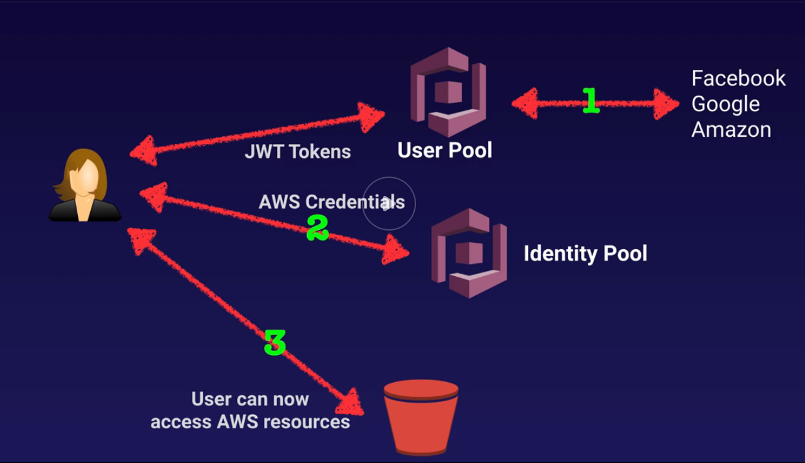

# Amazon cognito

- Web identity federation service: Let users access resources after successfully authenticated with Amazon, Facebook or Google.
- Cognito brokers between the app and Facebook/Google provides temporary credentials which maps to an IAM role, allowing access to required resources
- Application does not need to embed or store AWS credentials locally
- Synchronizes user data for multiple services (using SNS push)
- Recommended for all mobile AWS services

## User pools

- User based, handles user registration, authentication, account recovery, …
- Users can sign-in directly to the pool or using Facebook/Google
- Cognito acts as an identity broker between identity provider and AWS
- Successful auth generates JWT

## Identity pools

- Actual granting of permissions to use resources
- Provide temporary credentials to access AWS services (S3, DynamoDB, …)
