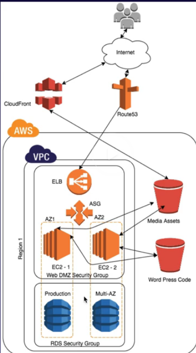

# Lab: High availability wordpress

- Uses S3 bucket for storing code and media, so that new instances can load the code/media directly after boot  
  _Why not EFS? AWS recommends it at [AWS sample Github](https://github.com/aws-samples/aws-refarch-wordpress)_
- Media bucket have public access by using a bucket policy
- URL are rewritten to cloudfront (using `.htacess` for apache)
- EC2 instance is created as base for AMI then used far auto scaling group
- One ec2 instance for writing wp content which pushes to S3.
- An auto scaling group of instances that serves content from S3.
- The autos scaling instances uses a bootstrap script to download the code content from s3
- Auto scaling group will receive traffic from load balancers

Reasons for using elb with only one ec2 instance: auto scaling will launch replacement if instance crashes

