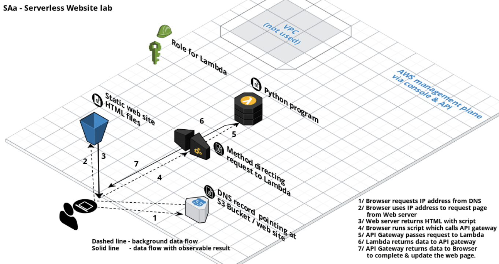

# Lambda

Exam: Know the lambda triggers

- Scales out (not up) automatically
- Can be used in multiple ways, for example:
  - as an event-driven compute service where code is ran in response to events like changes of data in S3 buckets or db tables
  - as a compute service to run code in response to http requests using API gateway or api calls made with AWS SDKs
- Priced on requests and duration
  - First 1 million requests are free, then 0.20 usd/1 million requests
  - Duration is execution time rounded up to nearest 100 ms. Pricing based on the amount of memory used, 0.00001667 USD/(Gb‧s)
- AWS X-ray allows debugging of what is happening in Lambda

## Example Serverless website

1. Browser requests IP address from DNS
2. Browser uses IP address to request (static) page from web server (hosted in S3 bucket)
3. Web server returns static web page with scripts
4. Browser runs script which calls API gateway
5. API gateway passes request to Lambda
6. Lambda returns data to API gateway
7. API gateway (optionally caches and) returns data to browser which updates/re-renders the web page

## Lambda triggers

- API gateway
- AWS IoT
- Alexa
- Application load balancer
- Cloudwatch events or logs
- CodeCommit
- Cognito sync trigger
- DynamoDB
- Kinesis
- S3
- SNS
- SQS
